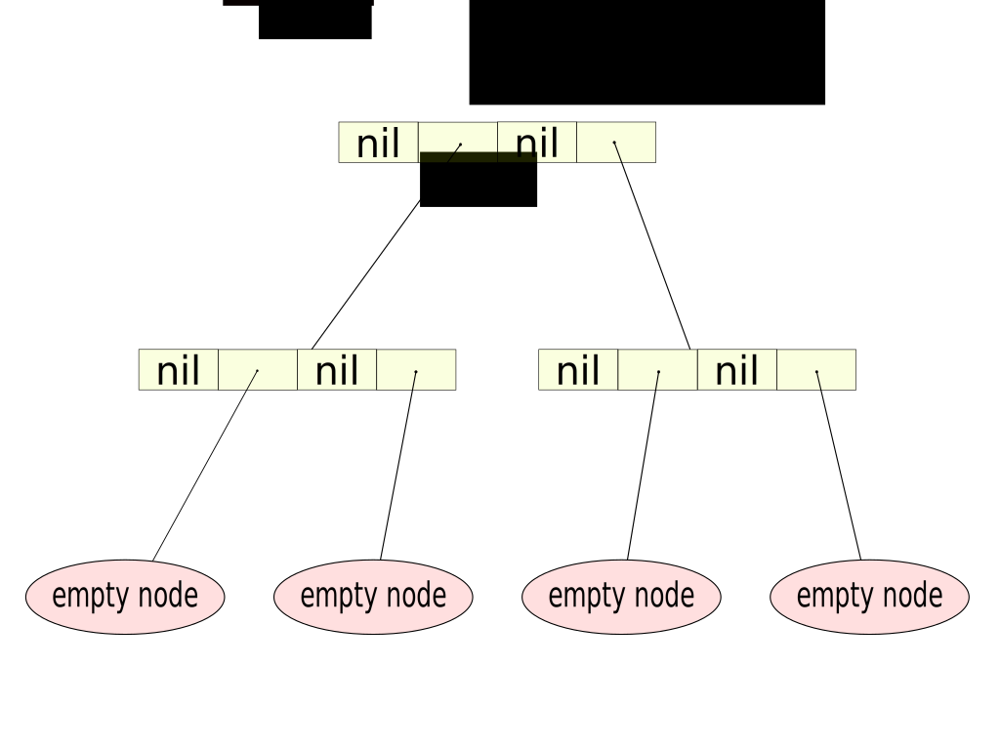

!SLIDE

# CHAMP Equality Check improvements

!SLIDE

# Clojure Puzzler
## Sloppy Cleaning

!SLIDE small

    @@@ clojure
    (def base-map (hash-map))
    (def one-million 1000000)

    (def full-map
      (reduce
       (fn [m i] (assoc m i 0))
       base-map
       (range one-million)))

    (def same-map
      (reduce
       (fn [m i] (dissoc m i))
       full-map
       (range one-million)))

    (= base-map same-map)     ;; true
    (time (into {} base-map)) ;; 140 microseconds
    (time (into {} same-map)) ;; ??? microseconds

!SLIDE

- A) 140 microseconds
- B) 280 microseconds
- C) 1400 microseconds
- D) 14000 microseconds
- E) 31000 microseconds

!SLIDE

## E) 31000 microseconds

!SLIDE

# Current Delete Algorithm

!SLIDE

!SLIDE

# This leads to

!SLIDE

!SLIDE

!SLIDE

# CHAMP Delete Algorithm

!SLIDE

!SLIDE

!SLIDE

## Lowers memory overhead that occurs from deletion

!SLIDE bullets

- So what? This only really matters in pathological cases
- Equal CHAMP maps have the exact same layout in memory
- We don't have to compare all Key Values we can compare nodes

!SLIDE

## Equality check is now O(log n) vs O(n) leading to 100x performance improvement
### This is when maps share structure

!SLIDE

!SLIDE

## We still get 10x performance boost for maps don't share any structure

- Current comparison has overhead due to Clojure abstractions (sequences and lookup)
- CHAMP comparison is only comparing two arrays
