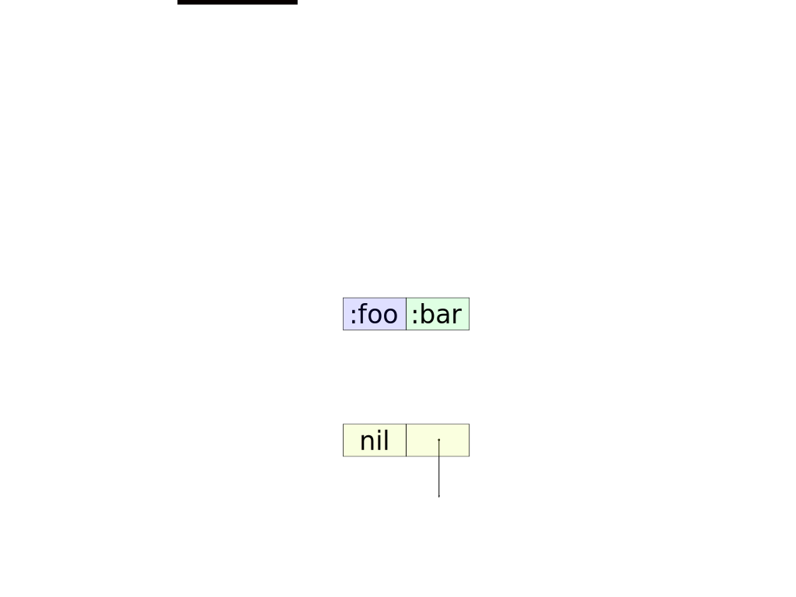
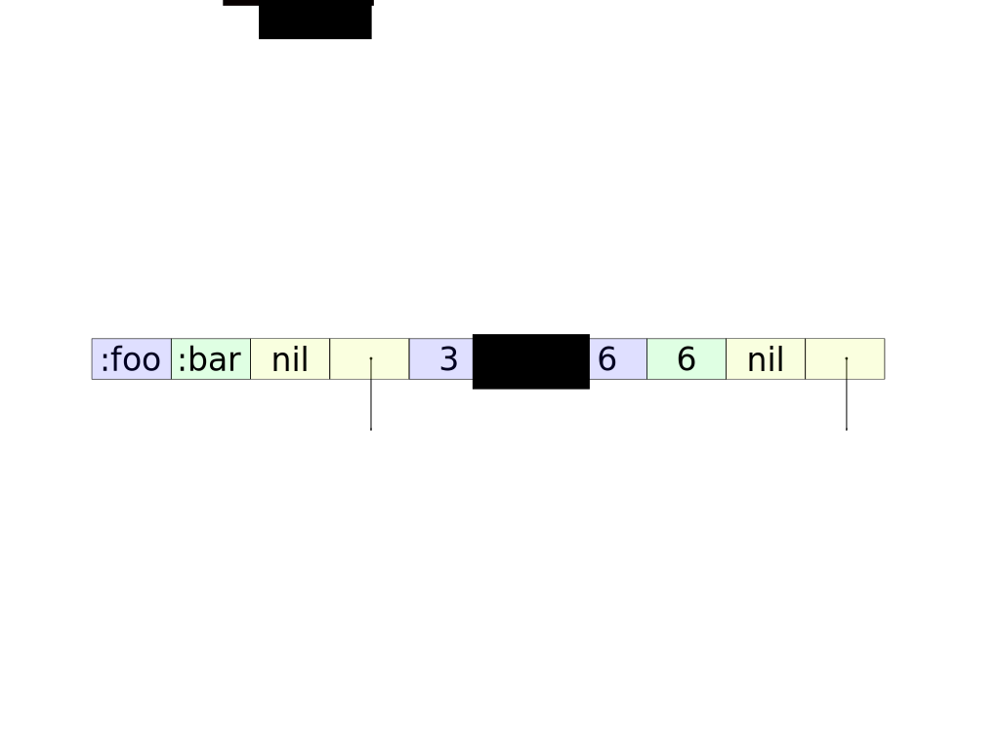
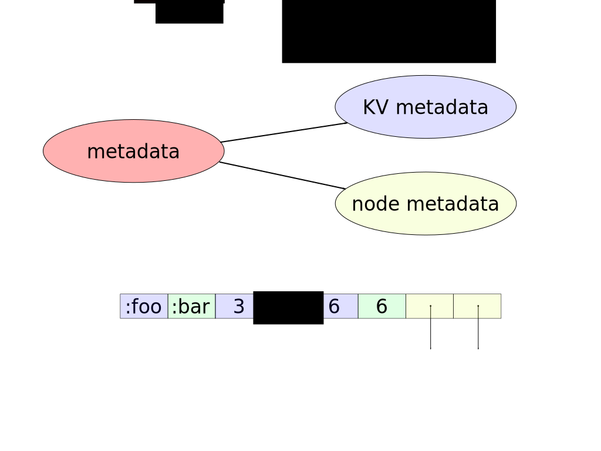

!SLIDE

# First major improvement
## Removes problems with sub node references

!SLIDE

## Sub node reference is a pseudo Key Value pair with nil as the "key"

!SLIDE

!SLIDE

## Doubles overhead for each sub node reference

!SLIDE

## Adds incidental complexity
- Needs a flag for `nil` key and field for `nil` values
- Optimized node (Array Node) just containing sub node references
  - Happens when normal node's array has 32 elements
- Further complications with second problem

!SLIDE

## Sub node references are scattered throughout a nodes array

!SLIDE

!SLIDE

Combined with `nil` marker value makes it so you have to ask "Is it a Key Value pair or sub node reference?" for every operation

!SLIDE

# Makes iteration a wiki walk

!SLIDE

## The Roman Empire was the post-**Roman Republic** period

!SLIDE

## The Roman Republic was the period of **ancient Roman civilization** beginning with the

!SLIDE

## Lots more link clicking...

!SLIDE

## Awareness is the ability to perceive, to feel, or to be conscious of events, objects, thoughts, emotions, or sensory patterns

!SLIDE

## What was the next word after **Roman Republic**?

!SLIDE

# Wiki Walk Iteration
- Bad locality
  - Blows the stack
  - CPU caches are never hot

!SLIDE

## CHAMP node improvements

!SLIDE

!SLIDE

!SLIDE

Lower memory overhead by removing `nil` marker values

!SLIDE

## Removes all sub node incidental complexity

- `nil` key flag
- `nil` value field
- Array Node
- Check for Key Value or Sub node reference

!SLIDE

## 2X speed up by changing iteration from wiki walk to a linear scan

!SLIDE smbullets

## Original Hash Map iteration algorithm (pseudocode)

- If `nil` flag is true return `[nil, <nil value>]`
- For normal nodes
  - If key is not `nil` then return the Key Value pair
  - Otherwise go to sub node and repeat
- For Array node
  - If element is `nil` continue
  - Otherwise go to sub node and repeat

!SLIDE

## CHAMP iteration algorithm

1) Iterate though Key Value pairs
1) Iterate through sub node(s) repeating step one

!SLIDE

# Comparison
- Seven lines vs two lines
- Three conditionals vs none
- Polymorphism vs no polymorphism
