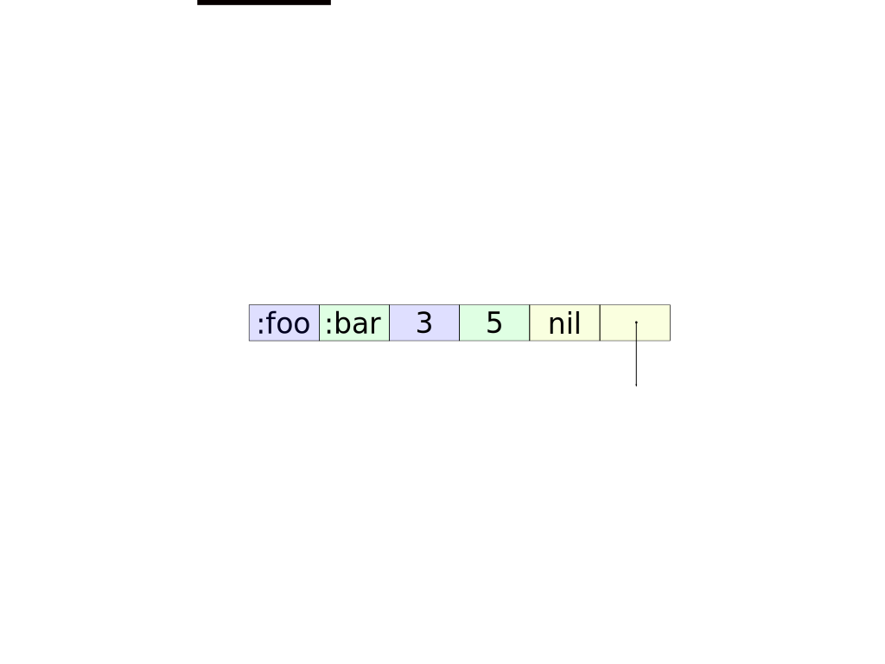
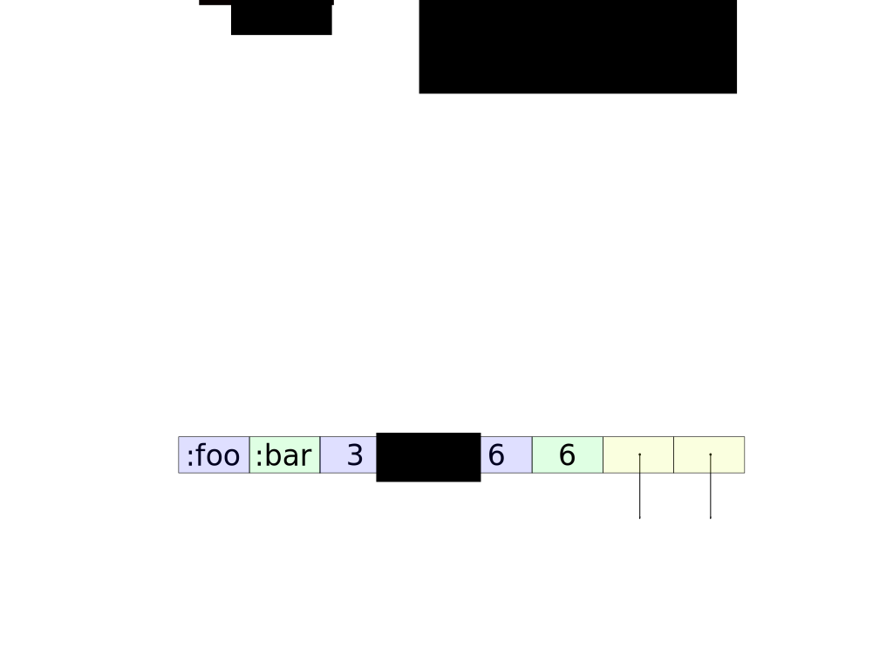

!SLIDE

# First major improvement
##  Removes warts from Hash Map nodes

!SLIDE

## Sub node reference is a psuedo Key Value pair with nil as the "key"

!SLIDE

!SLIDE

## Adds overhead for each sub node reference

!SLIDE

## Adds incidental complexity
- Needs a flag for `nil` key and field for `nil` values
- Calls for optimized node (Array Node) just containing sub node references

!SLIDE

## Sub node references are scattered throughout a nodes array

!SLIDE

!SLIDE

Combined with nil marker value makes it so you have to ask "Is it a Key Value pair or sub node reference?" for every operation

!SLIDE

# Makes iteration a wiki walk

!SLIDE

- The Roman Empire was the post-**Roman Republic** period
- The Roman Republic was the period of **ancient Roman civilization** beginning with the
- Lots more link clicking...
- Awareness is the ability to perceive, to feel, or to be conscious of events, objects, thoughts, emotions, or sensory patterns

!SLIDE

## CHAMP node improvements

!SLIDE

!SLIDE

!SLIDE

- Removes extra space taken up by nil marker values
- No incidental complexity (`nil` flag, Array Node)
- Iteration goes from a wiki walk to a linear scan

!SLIDE smbullets

## Current Hash Map iteration algorithm

- If `nil` flag is true return `[nil, <nil value>]`
- For normal nodes
  - If key is not `nil` then return the Key Value pair
  - Otherwise go to sub node and repeat
- For Array node
  - If element is `nil` continue
  - Otherwise go to sub node and repeat

!SLIDE

## CHAMP iteration algorithm

- Iterate though Key Value pairs
- Iterate through sub node(s) repeating step one

!SLIDE

# Two lines vs seven lines and no conditionals vs three
